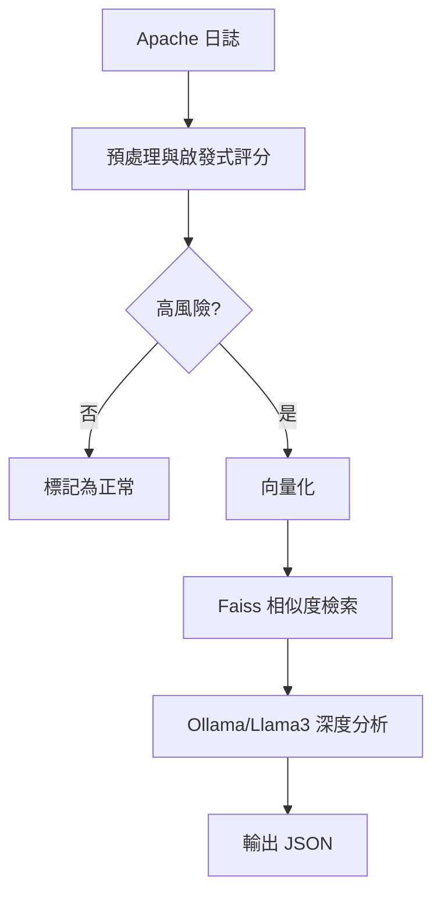

# Apache 日誌進階分析器

本專案是用於解析與偵測 Apache 日誌中潛在攻擊行為的工具，核心採用檢索增強生成（RAG）方式結合本地部署的 Llama3 模型。程式能增量讀取伺服器產生的 `.log`、`.gz` 或 `.bz2` 檔案，快速篩選出高風險請求，再利用向量化與語意比對發現相似模式，最後透過 Ollama 介接 Llama3 進行深入分析並產生結構化 JSON 報告。

## 技術特色
- **增量讀取**：紀錄 inode 與 offset，只處理新增內容
- **啟發式篩選**：依規則挑出可能的攻擊請求
- **向量資料庫**：使用 FAISS 儲存並比對相似攻擊模式
- **本地 LLM 分析**：透過 Docker 執行的 Ollama 呼叫 Llama3
- **成本控制**：可設定每小時的 LLM 使用費用上限

## 安裝與執行
1. 安裝 [Poetry](https://python-poetry.org/docs/#installation) 後執行 `poetry install`
2. 將 `.env.example` 複製為 `.env`，依需要調整 `OLLAMA_API_URL` 等參數
3. 透過 `poetry run python run.py` 進行分析

此工具適合在內部環境長期監控 Apache 伺服器，於離線或封閉網路中也能正常運作。

