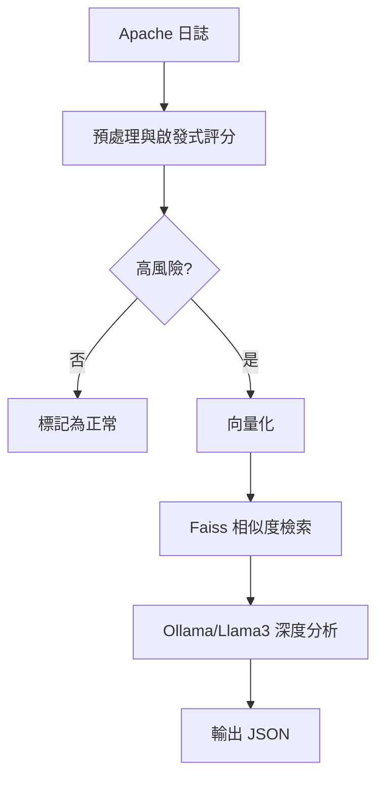

## 技術特色
- **增量讀取**：紀錄 inode 與 offset，只處理新產生的行
- **啟發式篩選**：依規則挑出可能的攻擊請求
- **向量資料庫**：使用 FAISS 儲存並比對相似攻擊模式
- **本地 LLM 分析**：透過 Docker 執行的 Ollama 呼叫 Llama3
- **成本控制**：可設定每小時的 LLM 使用費用上限

## 系統流程
1. 從指定目錄擷取最新日誌並記錄狀態，避免重複分析。
2. 先以啟發式規則判斷是否為可疑請求。
3. 高風險項目會計算文字向量並在 FAISS 中尋找相似紀錄。
4. 若命中舊資料則直接輸出結論，否則將該批送交 Llama3 分析。
5. LLM 回傳的 JSON 包含攻擊類型、成因與嚴重度，可即時整合到監控系統。
6. 所有索引與狀態皆儲存在 `data/` 目錄，方便持續累積與追蹤。

## 安裝與執行
1. 安裝 [Poetry](https://python-poetry.org/docs/#installation) 後執行 `poetry install`
2. 將 `.env.example` 複製為 `.env`，依需要調整 `OLLAMA_API_URL` 等參數
3. 透過 `poetry run python run.py` 開始分析

此工具適合於公司內網或斷網環境長期監控 Apache 伺服器，也能依需求擴充判斷規則與模型，使防禦機制更貼近實際攻擊手法。

